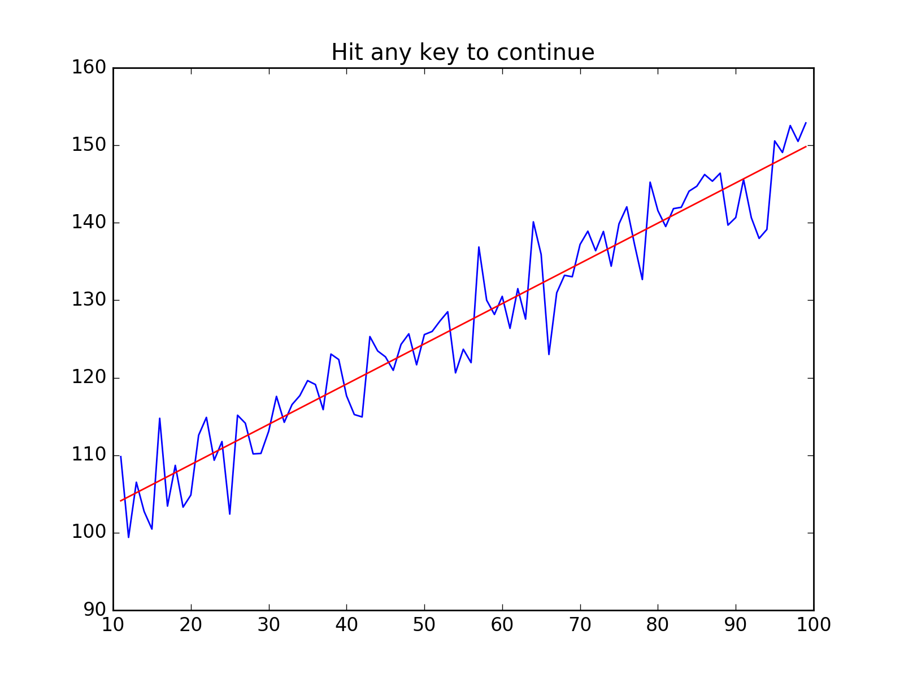

[](https://github.com/thomas-haslwanter/statsintro_python)

## [](http://quantlet.de/) **ISP_gettingStarted** [](http://quantlet.de/d3/ia)


```yaml
Name of QuantLet: ISP_gettingStarted

Published in:  An Introduction to Statistics with Python

Description: 'Short demonstration of Python for scientific data analysis
This script covers the following points:
* Plotting a sine wave
* Generating a column matrix of data
* Writing data to a text-file, and reading data from a text-file
* Waiting for a button-press to continue the program exectution
    (Note: this does NOT work in ipython, if you run it with inline figures!)
* Using a dictionary, which is similar to MATLAB structures
* Extracting data which fulfill a certain condition
* Calculating the best-fit-line to noisy data
* Formatting text-output
* Waiting for a keyboard-press
* Calculating confidence intervals for line-fits
* Saving figures
For such a short program, the definition of a <main> function, and calling
it by default when the module is imported by the main program, is a bit
superfluous. But it shows good Python coding style.'

Keywords: plot, fitting

See also: ISP_showPlots

Author: Thomas Haslwanter 

Submitted: October 31, 2015 

Output: linefit.png

```





```py
'''Short demonstration of Python for scientific data analysis

This script covers the following points:
* Plotting a sine wave
* Generating a column matrix of data
* Writing data to a text-file, and reading data from a text-file
* Waiting for a button-press to continue the program exectution
    (Note: this does NOT work in ipython, if you run it with inline figures!)
* Using a dictionary, which is similar to MATLAB structures
* Extracting data which fulfill a certain condition
* Calculating the best-fit-line to noisy data
* Formatting text-output
* Waiting for a keyboard-press
* Calculating confidence intervals for line-fits
* Saving figures

For such a short program, the definition of a "main" function, and calling
it by default when the module is imported by the main program, is a bit
superfluous. But it shows good Python coding style.
'''

# Copyright(c) 2015, Thomas Haslwanter. All rights reserved, under the BSD 3-Clause License

# In contrast to MATLAB, you explicitly have to load the modules that you need.
import numpy as np
import matplotlib.pyplot as plt

def main():
    '''Define the main function. '''
    
    # Create a sine-wave
    t = np.arange(0,10,0.1)
    x = np.sin(t)

    # Save the data in a text-file, in column form
    # The formatting is a bit clumsy: data are by default row variables; so to
    # get a matrix, you stack the two rows above each other, and then transpose
    # the matrix
    outFile = 'test.txt'
    np.savetxt(outFile, np.vstack([t,x]).T)

    # Read the data into a different variable
    inData = np.loadtxt(outFile)
    t2 = inData[:,0] # Note that Python starts at "0"!
    x2 = inData[:,1]

    # Plot the data, and wait for the user to click
    plt.plot(t2,x2)
    plt.title('Hit any key to continue')
    plt.waitforbuttonpress()

    # Generate a noisy line
    t = np.arange(-100,100)
    # use a Python "dictionary" for named variables
    par = {'offset':100, 'slope':0.5, 'noiseAmp':4}
    x = par['offset'] + par['slope']*t + par['noiseAmp']*np.random.randn(len(t))

    # Select "late" values, i.e. with t>10
    xHigh = x[t>10]
    tHigh = t[t>10]

    # Plot the "late" data
    plt.close()
    plt.plot(tHigh, xHigh)

    # Determine the best-fit line
    # To do so, you have to generate a matrix with "time" in the first
    # column, and a column of "1" in the second column:
    xMat = np.vstack((tHigh, np.ones_like(tHigh))).T
    slope, intercept = np.linalg.lstsq(xMat, xHigh)[0]

    # Show and plot the fit, and save it to a PNG-file with a medium resolution.
    # The "modern" way of Python-formatting is used
    plt.hold(True)
    plt.plot(tHigh, intercept + slope*tHigh, 'r')
    plt.title('Hit any key to continue')
    plt.savefig('linefit.png', dpi=200)
    plt.waitforbuttonpress()
    plt.close()
    print(('Fit line: intercept = {0:5.3f}, and slope = {1:5.3f}'.format(intercept, slope)))

    # If you want to know confidence intervals, best switch to "pandas"
    # Note that this is an advanced topic, and requires new data structures
    # such ad "DataFrames" and "ordinary-least-squares" or "ols-models".
    import pandas as pd
    
    # Put the data into a pandas DataFrame
    myDict = {'x':tHigh, 'y':xHigh}
    df = pd.DataFrame(myDict)
    
    # Fit the model
    model = pd.ols(y=df['y'], x=df['x'])
    
    # Print the results
    print(model)
    #raw_input('These are the summary results from Pandas - Hit any key to continue')


if __name__=='__main__':
    main()    # Execute the main function

```
