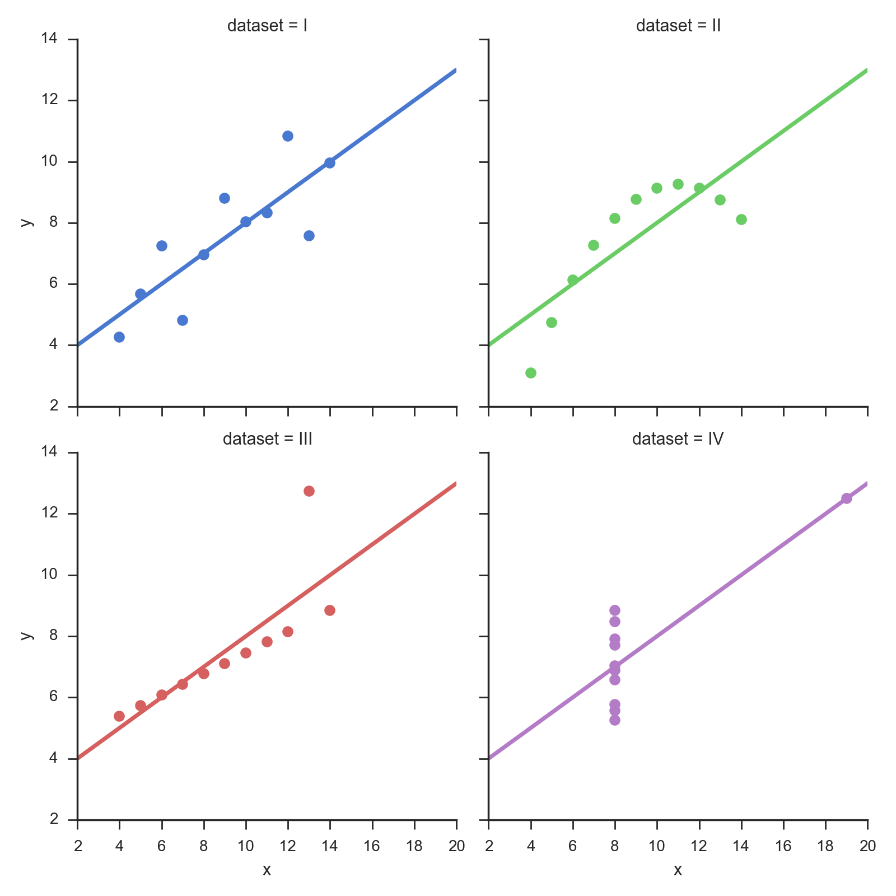

[](https://github.com/thomas-haslwanter/statsintro_python)

## [](http://quantlet.de/) **ISP_anscombe** [](http://quantlet.de/d3/ia)


```yaml
Name of QuantLet: ISP_anscombe

Published in:  An Introduction to Statistics with Python

Description: 'Code for generating Anscombe''s Quartet.
    Very closely based on the code from the seaborn-documentation
    http://web.stanford.edu/~mwaskom/software/seaborn/examples/anscombes_quartet.html
    Note that this program requires a web-connection to load the dataset!'

Keywords: 'anscombe''s quartet, linear regression'

See also: 'ISP_anovaOneway, ISP_anovaTwoway, ISP_kruskalWallis,
    ISP_multipleTesting, ISP_oneGroup, ISP_twoGroups' 

Author: Thomas Haslwanter 

Submitted: October 31, 2015 

Example: Anscombes_quartet.png  
```



```py
'''Code for generating Anscombe's Quartet.
Very closely based on the code from the seaborn-documentation
http://web.stanford.edu/~mwaskom/software/seaborn/examples/anscombes_quartet.html
Note that this program requires a web-connection to load the dataset!
'''

# Copyright(c) 2015, Thomas Haslwanter. All rights reserved, under the BSD 3-Clause License

# Import standard packages
import seaborn as sns
import os

# additional packages
import sys
sys.path.append(os.path.join('..', '..', 'Utilities'))

try:
# Import formatting commands if directory "Utilities" is available
    from ISP_mystyle import showData 
    
except ImportError:
# Ensure correct performance otherwise
    def showData(*options):
        plt.show()
        return

# additional packages
import sys
sys.path.append(os.path.join('..', '..', 'Utilities'))
import ISP_mystyle

sns.set(style="ticks")

# Load the example dataset for Anscombe's quartet
df = sns.load_dataset("anscombe")

# Show the results of a linear regression within each dataset
sns.lmplot(x="x", y="y", col="dataset", hue="dataset", data=df,
           col_wrap=2, ci=None, palette="muted", size=4,
           scatter_kws={"s": 50, "alpha": 1})           

outFile = 'Anscombes_quartet.png'
showData(outFile)
```
