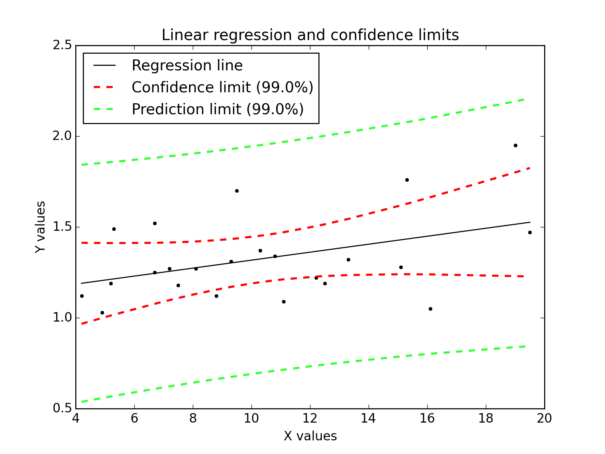

##  **ISP_fitLine**


```yaml
Name of QuantLet: ISP_fitLine

Published in:  An Introduction to Statistics with Python

Description: 'Linear regression fit

    Parameters
    ----------
    x : ndarray
        Input / Predictor    
    y : ndarray
        Input / Estimator    
    alpha : float
        Confidence limit [default=0.05]
    newx : float or ndarray
        Values for which the fit and the prediction limits are calculated (optional)
    plotFlag: int (optional)
        1 = plot, 0 = no_plot [default]
        
    Returns
    -------
    a : float
        Intercept
    b : float
        Slope
    ci : ndarray
        Lower and upper confidence interval for the slope
    info : dictionary, containing return information on
        - residuals
        - var_res
        - sd_res
        - alpha
        - tval
        - df
    newy : list(ndarray)
        Predictions for (newx, newx-ciPrediction, newx+ciPrediction)

    Examples
    --------
    >>> import numpy as np
    >>> from fitLine import fitLine
    >>> x = np.r_[0:10:11j]
    >>> y = x**2
    >>> (a,b,(ci_a, ci_b),_)=fitLine(x,y)    

    Notes
    -----
    Example data and formulas are taken from
    D. Altman, <Practical Statistics for Medicine>'

Keywords: line fit, confidence intervals, plot, linear regression

Author: Thomas Haslwanter 

Submitted: October 31, 2015 

Datafile:  

Example: regression_wLegend.png  
```





```py
'''
Linear regression fit

Parameters
----------
x : ndarray
    Input / Predictor    
y : ndarray
    Input / Estimator    
alpha : float
    Confidence limit [default=0.05]
newx : float or ndarray
    Values for which the fit and the prediction limits are calculated (optional)
plotFlag: int (optional)
    1 = plot, 0 = no_plot [default]
    
Returns
-------
a : float
    Intercept
b : float
    Slope
ci : ndarray
    Lower and upper confidence interval for the slope
info : dictionary, containing return information on
    - residuals
    - var_res
    - sd_res
    - alpha
    - tval
    - df
newy : list(ndarray)
    Predictions for (newx, newx-ciPrediction, newx+ciPrediction)

Examples
--------
>>> import numpy as np
>>> from fitLine import fitLine
>>> x = np.r_[0:10:11j]
>>> y = x**2
>>> (a,b,(ci_a, ci_b),_)=fitLine(x,y)    

Notes
-----
Example data and formulas are taken from
D. Altman, "Practical Statistics for Medicine"
'''

# Copyright(c) 2015, Thomas Haslwanter. All rights reserved, under the CC BY-SA 4.0 International License

# Import standard packages
import numpy as np
import matplotlib.pyplot as plt
import scipy.stats as stats

def fitLine(x, y, alpha=0.05, newx=[], plotFlag=1):
    ''' Fit a curve to the data using a least squares 1st order polynomial fit '''
    
    # Summary data
    n = len(x)			   # number of samples     
    
    Sxx = np.sum(x**2) - np.sum(x)**2/n
#    Syy = np.sum(y**2) - np.sum(y)**2/n    # not needed here
    Sxy = np.sum(x*y) - np.sum(x)*np.sum(y)/n    
    mean_x = np.mean(x)
    mean_y = np.mean(y)
    
    # Linefit
    b = Sxy/Sxx
    a = mean_y - b*mean_x
    
    # Residuals
    fit = lambda xx: a + b*xx    
    residuals = y - fit(x)
    
    var_res = np.sum(residuals**2)/(n-2)
    sd_res = np.sqrt(var_res)
    
    # Confidence intervals
    se_b = sd_res/np.sqrt(Sxx)
    se_a = sd_res*np.sqrt(np.sum(x**2)/(n*Sxx))
    
    df = n-2                            # degrees of freedom
    tval = stats.t.isf(alpha/2., df) 	# appropriate t value
    
    ci_a = a + tval*se_a*np.array([-1,1])
    ci_b = b + tval*se_b*np.array([-1,1])

    # create series of new test x-values to predict for
    npts = 100
    px = np.linspace(np.min(x),np.max(x),num=npts)
    
    se_fit     = lambda x: sd_res * np.sqrt(  1./n + (x-mean_x)**2/Sxx)
    se_predict = lambda x: sd_res * np.sqrt(1+1./n + (x-mean_x)**2/Sxx)
    
    print(('Summary: a={0:5.4f}+/-{1:5.4f}, b={2:5.4f}+/-{3:5.4f}'.format(a,tval*se_a,b,tval*se_b)))
    print(('Confidence intervals: ci_a=({0:5.4f} - {1:5.4f}), ci_b=({2:5.4f} - {3:5.4f})'.format(ci_a[0], ci_a[1], ci_b[0], ci_b[1])))
    print(('Residuals: variance = {0:5.4f}, standard deviation = {1:5.4f}'.format(var_res, sd_res)))
    print(('alpha = {0:.3f}, tval = {1:5.4f}, df={2:d}'.format(alpha, tval, df)))
    
    # Return info
    ri = {'residuals': residuals, 
        'var_res': var_res,
        'sd_res': sd_res,
        'alpha': alpha,
        'tval': tval,
        'df': df}
    
    if plotFlag == 1:
        # Plot the data
        plt.figure()
        
        plt.plot(px, fit(px),'k', label='Regression line')
        #plt.plot(x,y,'k.', label='Sample observations', ms=10)
        plt.plot(x,y,'k.')
        
        x.sort()
        limit = (1-alpha)*100
        plt.plot(x, fit(x)+tval*se_fit(x), 'r--', lw=2, label='Confidence limit ({0:.1f}%)'.format(limit))
        plt.plot(x, fit(x)-tval*se_fit(x), 'r--', lw=2 )
        
        plt.plot(x, fit(x)+tval*se_predict(x), '--', lw=2, color=(0.2,1,0.2), label='Prediction limit ({0:.1f}%)'.format(limit))
        plt.plot(x, fit(x)-tval*se_predict(x), '--', lw=2, color=(0.2,1,0.2))

        plt.xlabel('X values')
        plt.ylabel('Y values')
        plt.title('Linear regression and confidence limits')
        
        # configure legend
        plt.legend(loc=0)
        leg = plt.gca().get_legend()
        ltext = leg.get_texts()
        plt.setp(ltext, fontsize=14)

        # show the plot
        outFile = 'regression_wLegend.png'
        plt.savefig(outFile, dpi=200)
        print('Image saved to {0}'.format(outFile))
        plt.show()
        
    if newx != []:
        try:
            newx.size
        except AttributeError:
            newx = np.array([newx])
    
        print(('Example: x = {0}+/-{1} => se_fit = {2:5.4f}, se_predict = {3:6.5f}'\
        .format(newx[0], tval*se_predict(newx[0]), se_fit(newx[0]), se_predict(newx[0]))))
        
        newy = (fit(newx), fit(newx)-se_predict(newx), fit(newx)+se_predict(newx))
        return (a,b,(ci_a, ci_b), ri, newy)
    else:
        return (a,b,(ci_a, ci_b), ri)
    
if __name__ == '__main__':
        # example data
        x = np.array([15.3, 10.8, 8.1, 19.5, 7.2, 5.3, 9.3, 11.1, 7.5, 12.2,
                      6.7, 5.2, 19.0, 15.1, 6.7, 8.6, 4.2, 10.3, 12.5, 16.1, 
                      13.3, 4.9, 8.8, 9.5])
        y = np.array([1.76, 1.34, 1.27, 1.47, 1.27, 1.49, 1.31, 1.09, 1.18, 
                      1.22, 1.25, 1.19, 1.95, 1.28, 1.52, np.nan, 1.12, 1.37, 
                      1.19, 1.05, 1.32, 1.03, 1.12, 1.70])
                      
        goodIndex = np.invert(np.logical_or(np.isnan(x), np.isnan(y)))
        (a,b,(ci_a, ci_b), ri,newy) = fitLine(x[goodIndex],y[goodIndex], alpha=0.01,newx=np.array([1,4.5]))        
```
