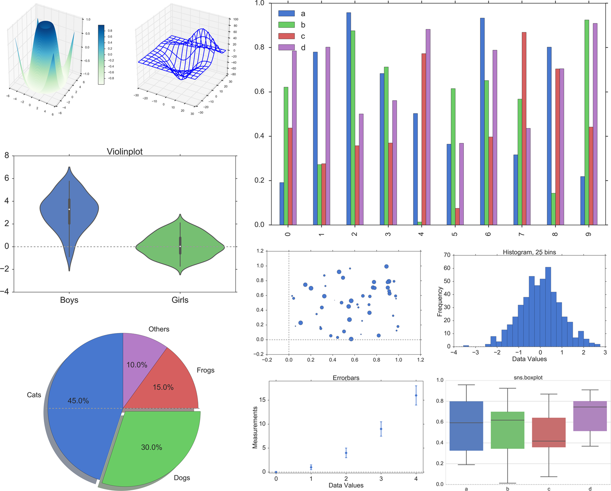

##  **ISP_showPlots**


```yaml
Name of QuantLet: ISP_showPlots

Published in:  An Introduction to Statistics with Python

Description: 'Show different ways to present statistical data
    The examples contain:
    - scatter plots, with 1-dimensional and higher-dimensional data
    - histograms
    - cumulative density functions
    - KDE-plots
    - boxplots
    - errorbars
    - violinplots
    - barplots
    - grouped boxplots
    - pieplots
    - scatterplots, with markersize proportional to value of corresponding variable
    - 3D surface and wireframe plots'

Keywords: data visualization, plot, visualization

See also: ISP_gettingStarted

Author: Thomas Haslwanter 

Submitted: October 31, 2015 

Example:  
- 3dGraph.png
- barplot.png
- bivariate.png
- boxplot.png
- groupedBoxplot.png
- histogram.png
- multiScatterplot.png
- piePlot.png
- violinplot.png

```





```py
''' Show different ways to present statistical data

The examples contain:
- scatter plots, with 1-dimensional and higher-dimensional data
- histograms
- cumulative density functions
- KDE-plots
- boxplots
- errorbars
- violinplots
- barplots
- grouped boxplots
- pieplots
- scatterplots, with markersize proportional to the value of a corresponding variable
- 3D surface and wireframe plots
'''

# author: Thomas Haslwanter, date: Nov-2015

# First, import the libraries that you are going to need. You could also do
# that later, but it is better style to do that at the beginning.

# pylab imports the numpy, scipy, and matplotlib.pyplot libraries into the
# current environment

# Import standard packages
import numpy as np
import matplotlib.pyplot as plt
import scipy.stats as stats
import seaborn as sns
import pandas as pd
import os

# additional packages
import matplotlib as mpl

import sys
sys.path.append(os.path.join('..', '..', 'Utilities'))
try:
# Import formatting commands if directory "Utilities" is available
    from ISP_mystyle import setFonts, showData 
    
except ImportError:
# Ensure correct performance otherwise
    def setFonts(*options):
        return
    def showData(*options):
        plt.show()
        return

def printout(outFile, xlabel = '', ylabel='', title='', outDir = '.'):
    '''Save the current figure to a file, and then display it'''
    
    plt.xlabel(xlabel)
    plt.ylabel(ylabel)
    plt.title(title)
    
    plt.tight_layout
    
    xlim = plt.gca().get_xlim()
    plt.hlines(0, xlim[0], xlim[1], linestyles='--', colors='#999999')
    plt.gca().set_xlim(xlim)
    
    saveTo = os.path.join(outDir, outFile)
    plt.savefig(saveTo, dpi=200)
    
    print('OutDir: {0}'.format(outDir))
    print('Figure saved to {0}'.format(outFile))
    
    plt.show()
    plt.close()
    
def simplePlots():
    '''Demonstrate the generation of different statistical standard plots'''
    
    # Univariate data -------------------------
    
    # Make sure that always the same random numbers are generated
    np.random.seed(1234)
    
    # Generate data that are normally distributed
    x = np.random.randn(500)
    
    # Other graphics settings
    sns.set(context='poster', style='ticks', palette=sns.color_palette('muted'))
    
    # Set the fonts the way I like them
    setFonts(32)
    
    # Scatter plot
    plt.scatter(np.arange(len(x)), x)
    plt.xlim([0, len(x)])
    
    # Save and show the data, in a systematic format
    printout('scatterPlot.png', xlabel='Datapoints', ylabel='Values', title='Scatter')
    
    # Histogram
    plt.hist(x)
    printout('histogram_plain.png', xlabel='Data Values',
             ylabel='Frequency', title='Histogram, default settings')
    
    plt.hist(x,25)
    printout('histogram.png', xlabel='Data Values', ylabel='Frequency',
             title='Histogram, 25 bins')
    
    # Cumulative probability density
    numbins = 20
    plt.plot(stats.cumfreq(x,numbins)[0])
    printout('CumulativeFrequencyFunction.png', xlabel='Data Values',
             ylabel='CumFreq', title='Cumulative Frequency')

    # KDE-plot
    sns.kdeplot(x)
    printout('kde.png', xlabel='Data Values', ylabel='Density',
            title='KDE_plot')
    
    # Boxplot
    # The ox consists of the first, second (middle) and third quartile
    plt.boxplot(x, sym='*')
    printout('boxplot.png', xlabel='Values', title='Boxplot')
    
    plt.boxplot(x, sym='*', vert=False)
    plt.title('Boxplot, horizontal')
    plt.xlabel('Values')
    plt.show()
    
    # Errorbars
    x = np.arange(5)
    y = x**2
    errorBar = x/2
    plt.errorbar(x,y, yerr=errorBar, fmt='o', capsize=5, capthick=3)
    plt.xlim([-0.2, 4.2])
    plt.ylim([-0.2, 19])
    printout('Errorbars.png', xlabel='Data Values', ylabel='Measurements', title='Errorbars')
    
    # Violinplot
    nd = stats.norm
    data = nd.rvs(size=(100))
    
    nd2 = stats.norm(loc = 3, scale = 1.5)
    data2 = nd2.rvs(size=(100))
    
    # Use pandas and the seaborn package for the violin plot
    df = pd.DataFrame({'Girls':data, 'Boys':data2})
    sns.violinplot(df)
    
    printout('violinplot.png', title='Violinplot')
    
    # Barplot
    # The font-size is set such that the legend does not overlap with the data
    np.random.seed(1234)
    setFonts(20)
    
    df = pd.DataFrame(np.random.rand(10, 4), columns=['a', 'b', 'c', 'd'])
    df.plot(kind='bar', grid=False, color=sns.color_palette('muted'))
    
    showData('barplot.png')
    setFonts(28)

    # Bivariate Plots
    df2 = pd.DataFrame(np.random.rand(50, 3), columns=['a', 'b', 'c'])
    df2.plot(kind='scatter', x='a', y='b', s=df2['c']*500);
    plt.axhline(0, ls='--', color='#999999')
    plt.axvline(0, ls='--', color='#999999')
    printout('bivariate.png')
    
    # Grouped Boxplot
    sns.set_style('whitegrid')
    sns.boxplot(df)
    setFonts(28)
    printout('groupedBoxplot.png', title='sns.boxplot')

    sns.set_style('ticks')

    # Pieplot
    txtLabels = 'Cats', 'Dogs', 'Frogs', 'Others'
    fractions = [45, 30, 15, 10]
    offsets =(0, 0.05, 0, 0)
    
    plt.pie(fractions, explode=offsets, labels=txtLabels,
            autopct='%1.1f%%', shadow=True, startangle=90,
            colors=sns.color_palette('muted') )
    plt.axis('equal')
    printout('piePlot.png', title=' ')

def show3D():
    '''Generation of 3D plots'''
    
    # imports specific to the plots in this example
    from matplotlib import cm   # colormaps
    
    # This module is required for 3D plots!
    from mpl_toolkits.mplot3d import Axes3D
    
    # Twice as wide as it is tall.
    fig = plt.figure(figsize=plt.figaspect(0.5))
    setFonts(16)
    
    #---- First subplot
    # Generate the data
    X = np.arange(-5, 5, 0.1)
    Y = np.arange(-5, 5, 0.1)
    X, Y = np.meshgrid(X, Y)
    R = np.sqrt(X**2 + Y**2)
    Z = np.sin(R)
    
    # Note the definition of "projection", required for 3D  plots
    #plt.style.use('ggplot')

    ax = fig.add_subplot(1, 2, 1, projection='3d')
    surf = ax.plot_surface(X, Y, Z, rstride=1, cstride=1, cmap=cm.GnBu,
            linewidth=0, antialiased=False)
    #surf = ax.plot_surface(X, Y, Z, rstride=1, cstride=1, cmap=cm.viridis_r,
            #linewidth=0, antialiased=False)
    ax.set_zlim3d(-1.01, 1.01)
    
    fig.colorbar(surf, shrink=0.5, aspect=10)
    
    #---- Second subplot
    # Get some 3d test-data
    from mpl_toolkits.mplot3d.axes3d import get_test_data
    
    ax = fig.add_subplot(1, 2, 2, projection='3d')
    X, Y, Z = get_test_data(0.05)
    ax.plot_wireframe(X, Y, Z, rstride=10, cstride=10)

    showData('3dGraph.png')
    
if __name__ == '__main__':
    simplePlots()
    show3D()
