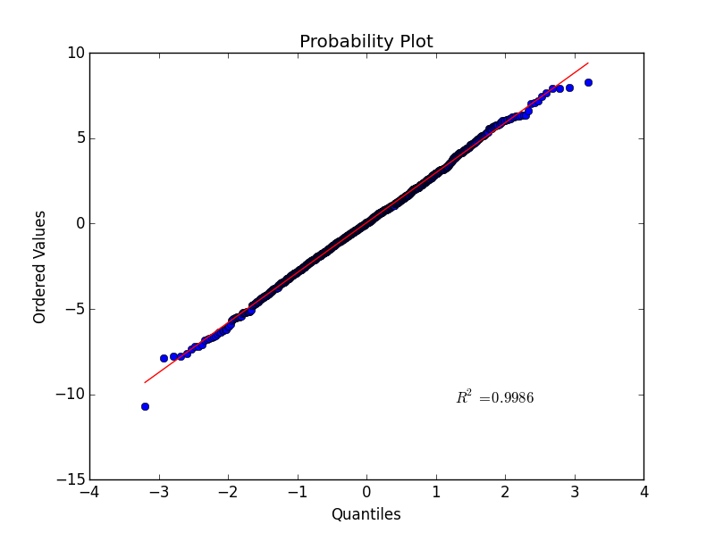

##  **ISP_checkNormality**


```yaml
Name of QuantLet: ISP_checkNormality

Published in:  An Introduction to Statistics with Python

Description: 'Graphical and quantitative check, if a given distribution is normal.
    - For small sample-numbers (<50), you should use the Shapiro-Wilk test or the "normaltest"
    - for intermediate sample numbers, the Lilliefors-test is good since the original Kolmogorov-Smirnov-test is unreliable when mean and std of the distribution
    are not known.
    - the Kolmogorov-Smirnov(Kolmogorov-Smirnov) test should only be used for
      large sample numbers (>300)'

Keywords: lilliefors test, shapiro-wilk test, kolmogorov-smirnov test, omnibus test, qq-plot, probplot

See also: ISP_sampleSize

Author: Thomas Haslwanter 

Submitted: October 31, 2015 

Example: NormalityCheck.png  
```





```py
'''
Graphical and quantitative check, if a given distribution is normal.
- For small sample-numbers (<50), you should use the Shapiro-Wilk test or the "normaltest"
- for intermediate sample numbers, the Lilliefors-test is good since the original Kolmogorov-Smirnov-test is unreliable when mean and std of the distribution
are not known.
- the Kolmogorov-Smirnov(Kolmogorov-Smirnov) test should only be used for large sample numbers (>300)
'''

# author: Thomas Haslwanter, date: Oct-2015

# Import standard packages
import numpy as np
import matplotlib.pyplot as plt
import scipy.stats as stats
import pandas as pd

# additional packages
from statsmodels.stats.diagnostic import lillifors

def check_normality():
    '''Check if the distribution is normal.'''
    
    # Set the parameters
    numData = 1000
    myMean = 0
    mySD = 3
    
    # To get reproducable values, I provide a seed value
    np.random.seed(1234)   
    
    # Generate and show random data
    data = stats.norm.rvs(myMean, mySD, size=numData)
    fewData = data[:100]
    plt.hist(data)
    plt.show()

    # --- >>> START stats <<< ---
    # Graphical test: if the data lie on a line, they are pretty much
    # normally distributed
    _ = stats.probplot(data, plot=plt)
    plt.show()

    pVals = pd.Series()
    pFewVals = pd.Series()
    # The scipy normaltest is based on D-Agostino and Pearsons test that
    # combines skew and kurtosis to produce an omnibus test of normality.
    _, pVals['Omnibus']    = stats.normaltest(data)
    _, pFewVals['Omnibus'] = stats.normaltest(fewData)

    # Shapiro-Wilk test
    _, pVals['Shapiro-Wilk']    = stats.shapiro(data)
    _, pFewVals['Shapiro-Wilk'] = stats.shapiro(fewData)
    
    # Or you can check for normality with Lilliefors-test
    _, pVals['Lilliefors']    = lillifors(data)
    _, pFewVals['Lilliefors'] = lillifors(fewData)
    
    # Alternatively with original Kolmogorov-Smirnov test
    _, pVals['Kolmogorov-Smirnov']    = stats.kstest((data-np.mean(data))/np.std(data,ddof=1), 'norm')
    _, pFewVals['Kolmogorov-Smirnov'] = stats.kstest((fewData-np.mean(fewData))/np.std(fewData,ddof=1), 'norm')
    
    print('p-values for all {0} data points: ----------------'.format(len(data)))
    print(pVals)
    print('p-values for the first 100 data points: ----------------')
    print(pFewVals)
    
    if pVals['Omnibus'] > 0.05:
        print('Data are normally distributed')
    # --- >>> STOP stats <<< ---
    
    return pVals['Kolmogorov-Smirnov']
    
if __name__ == '__main__':
    p = check_normality()    
    print(p)

```
